# Project 2:Ames Housing Data Analysis

## Executive Summary

## Problem statement

As a data scientist working for an up and coming real estate app, how can we optimize predicting pricing outcomes for homeowners looking to sell? Whether it’s the homeowner pricing too high, leading their homes unsellable even in good markets or homeowners not maximizing the profits by listing the prices too low. We can optimize the predictions through feature engineering and linear regression so that we can have an R2 score that exceeds a baseline model. We can also gain insights how these features contribute to pricing as well.

### Description of Dataset
The two datasets used for this project are a test and train component of the Ames housing dataset, which was obtained via project lesson plan from the course.
* [`train.csv`](../datasets/train.csv): Ames Housing Data Train Set
* [`test.csv`](../datasets/test.csv):Ames Housing Data Test Set

Data Dictionary can be found *[Here!](http://jse.amstat.org/v19n3/decock/DataDocumentation.txt)*.

## Data Visualizations & Analysis
### Highest Correlated features

 
This heat map gives us a good look at the features with the highest correlation. Such as 'Overall Quality'.81, 'Above grade (ground) living area square feet' at .71.  Some of the features with no effect whatsoever are '3 season porch area(sq. ft)' at .037 and the month sold at .026.

### Exploring some relationships with the highest correlated features

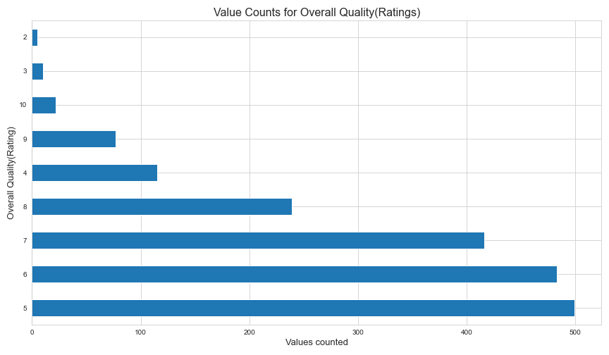
 
This is a feature with a high correlation of .79. We can see most of the houses are between a quality rating of 5 and 8.  Data engineered from this feature to create a binary high quality column where we have the quality be at least an 8.

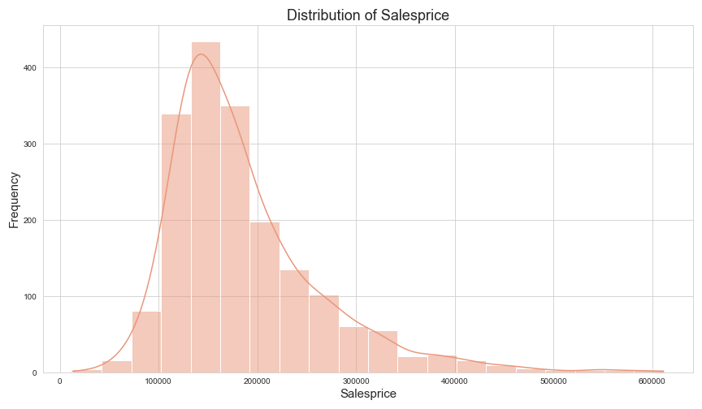
 
Looks like most values in the data set are between 120,000 to a little under 280,000.  This is also a right-skewed distribution as the long tail extends to the right as most values are show on the left side(between 90,000 & 340,000). You can also see a value of 600,000 as an outlier as well.

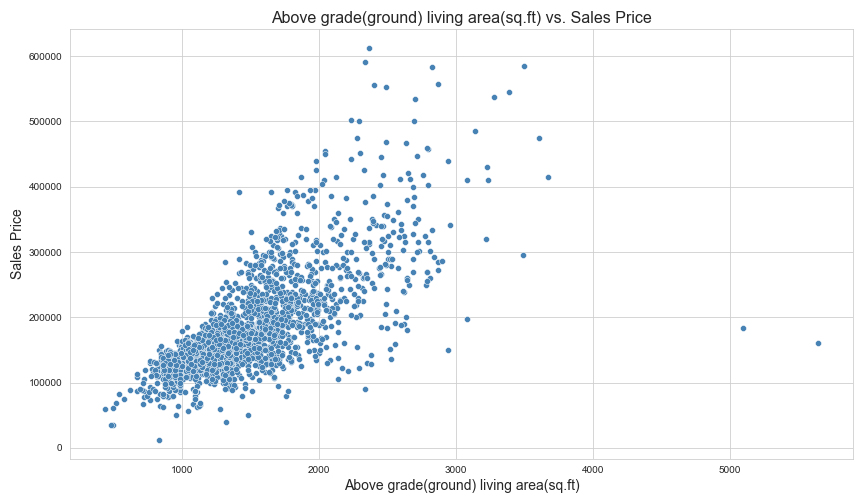
 
This is a slightly higher than moderate linear relationship, it takes on the shape of a fan. Its correlation is .71.

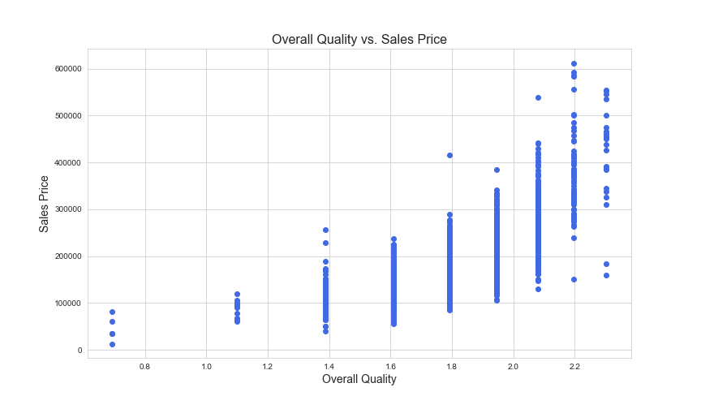
 
For categorical features such as overall quality, the logarithmic base can bend the scale such that we can see a relationship between overall quality and sale price.  This actually has a higher correlation than the previous example at .79.

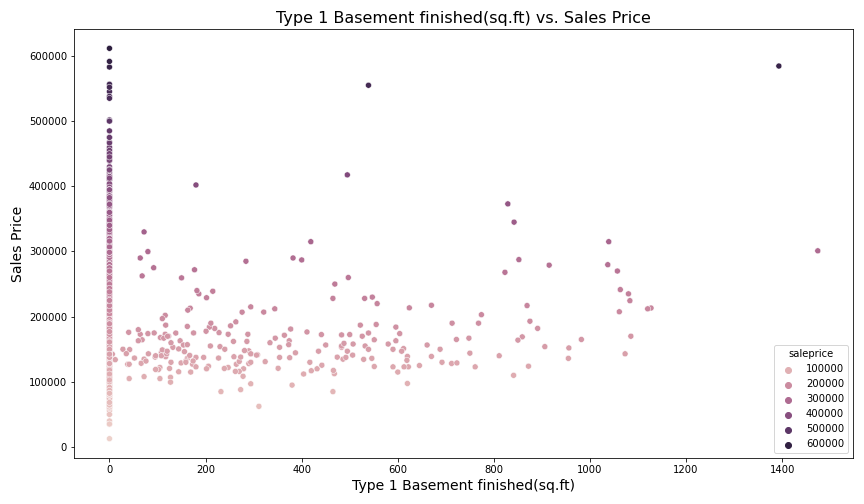

A feature with low correlations, this one is -0.002936.
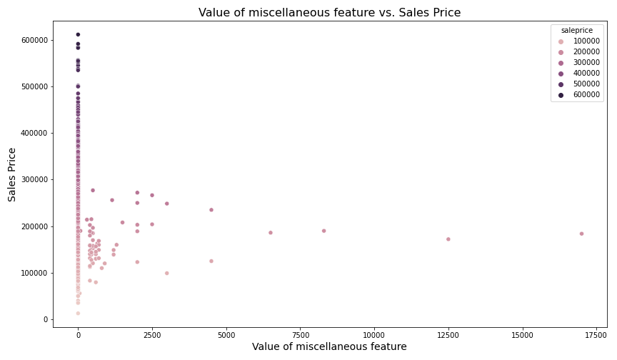

This one has a correlation of -0.007502

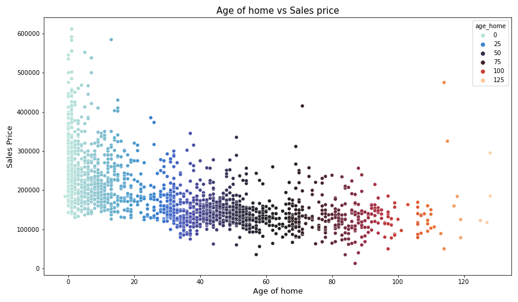
 
Age of home is a feature that was engineered with a negative correlation, which dictates that the "younger" the home the more the sales price is.

## Finding the right model

Part of finding the right model will involve a few factors, what is the R2 Score?  The R2 indicates how much of the variability in our target is explained by the features in our model. This can help us assess which regression model gives us the best predictions.

Interpreting coefficients can be explained as, for every 1 unit increase of a particular feature, we expect the target to increase by the coefficient amount. For those models that are not scaled, this can be a good way to see how the features contribute from a dollar amount to get insight into what contributes heavily to the sales price of these homes.

Another important aspect to consider is how a model performs in terms of bias-variance.  Typically when a model is high bias, this model is considered underfit. This indicates a model that is bad at predicting a target. Whether its data that it has trained on it or unseen data.  In this case we need to increase variance, and we can do that with complexity of the model, that is adding more features.
On the other hand a high variance model indicates a complicated model that does not do well generalizing to new data.  This can indicate that the model needs to be simplified. An overfit model does well on the data its trained on, but not on the unseen data. We can tackle this issue through regularization(ridge or lasso), or simplifying the model with less features.

Reference
Lesson 3.02 - Regression Metrics

### Model 1

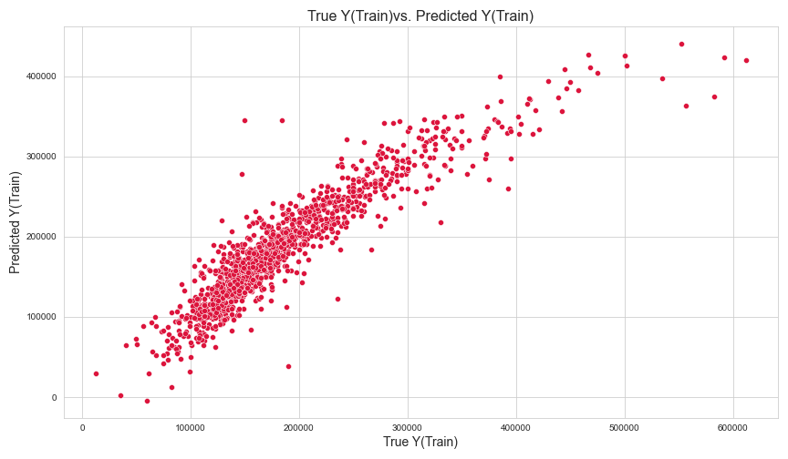

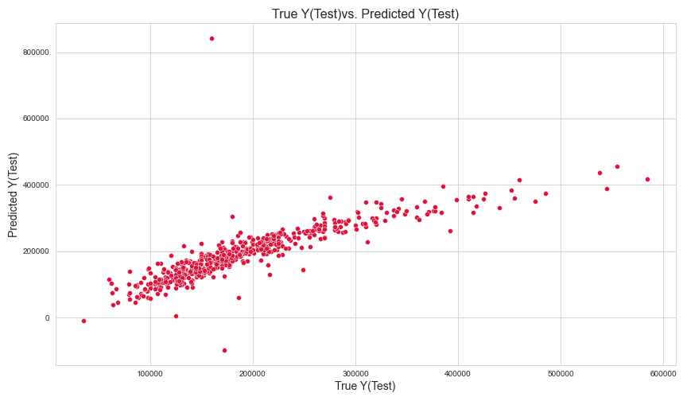

From the cross validation before fitting the model we established a baseline R2 score of 81.71% and 67.59%. There is a drop in the test set score as it does not do as good of a job generalizing to new data. Indicating that the model is overfit and has high variance as its baseline.  When we actually run the model we get scores of 86.28% and 73.46%.  While both scores see an increase the model is still overfit and regularization could help decrease the variance.

### Model 2

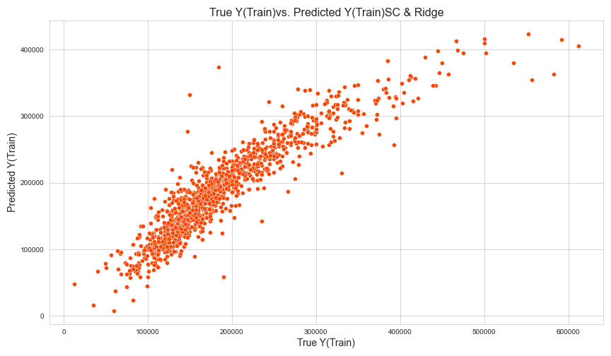
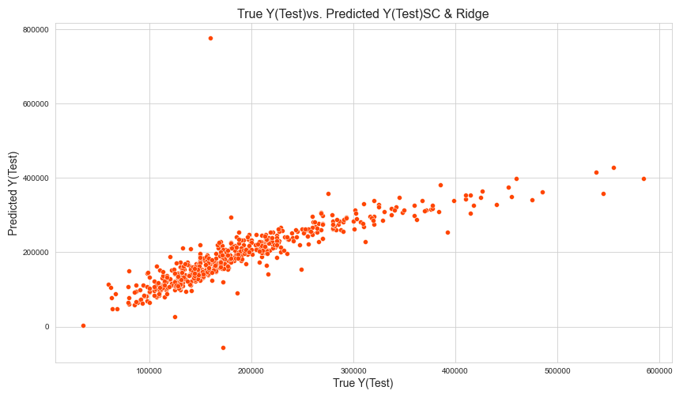

Using Ridge we see a minimal difference between the original and the ridge version. Just that the training and test scores are a bit closer together. Original scores were 86.28%(training) and 73.46%(testing) compared to ridge scores of 85.80%(training) and 76.02%(testing).  We can see Ridge had a slightly worse performance with testing and slightly better with training, which also lowered the variance and made it slightly less overfit. It is also worth noting that this was also preprocessed via Standard Scaler, in order to account for the dimensionality differences within these features(such as square footage).Scaling is required so that regularization penalizes each variable equally fairly. This indicates a need for features that are more signal than noise, in order to strengthen the model's overall performance, increasing feature engineering that is guided by the research can help with this.

### Model 3
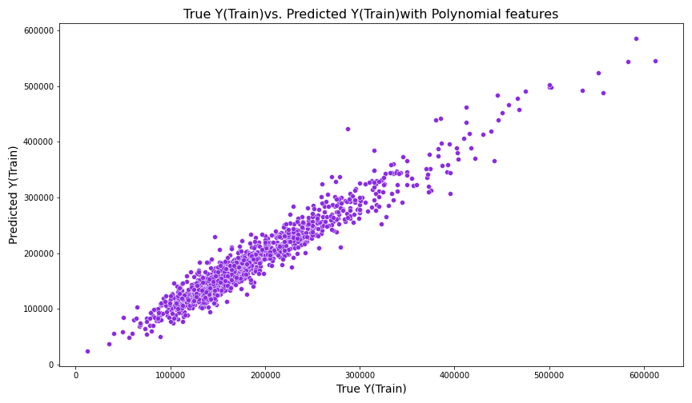

This model is doing worse than the first model when it comes to generalizing to new data. While the R2 scoring was high on the training data set 94%. R2 can have a negative value when the model is so bad at following the trend of the data that it does worse to fit it than a horizontal line or just picking something at random. The R2 for the test data was -42%.  It looks like executing the polynomial features on all the existing features did not do the trick, and its back to the drawing board. The next model will also make use of standard scaler since the different dimensions that all these features use could have become way too different in magnitude.

[Reference Here](https://medium.com/analytics-vidhya/is-it-possible-to-have-a-negative-r-square-847a6a4a2fbe)

### Model 4
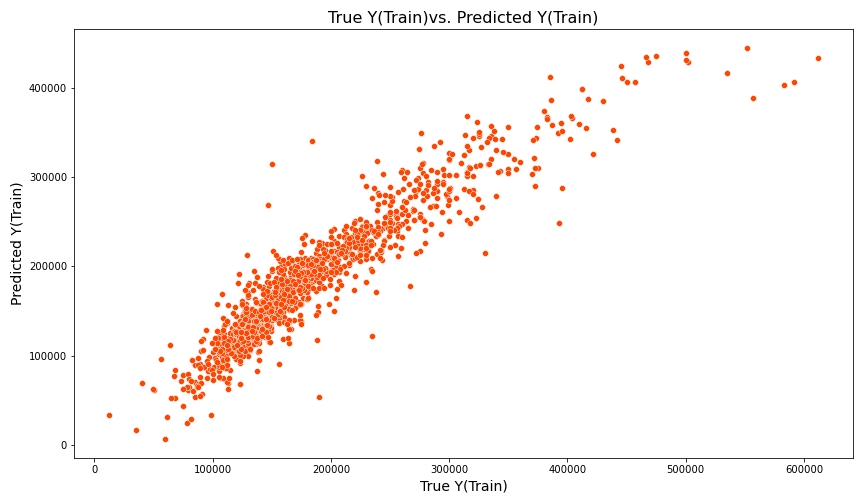
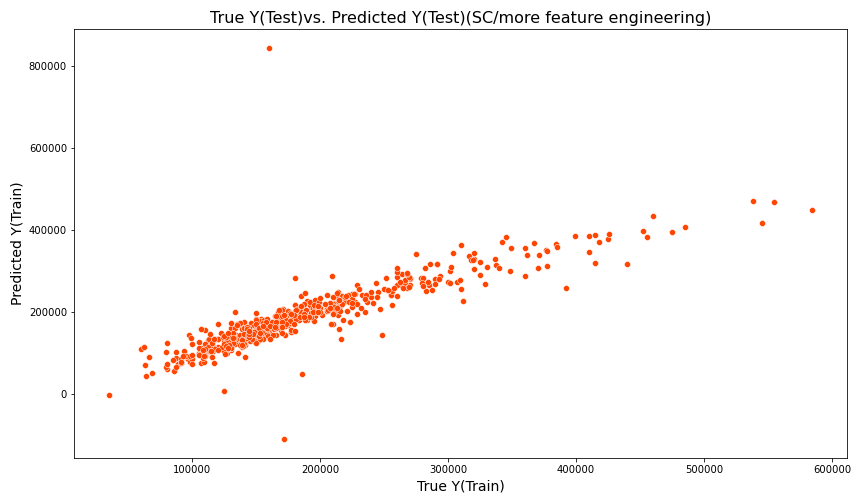

The previous model was horrible, but by using standard scaler it must have controlled for all the differences in magnitude whether its square footage vs age of the home. Properly scaling the numbers made R2 jump to 88.24% on the training set and 80.64% on the test sit and it outperforms model 1. On the other hand this model is overfit, and will need to use regularization in order to decrease the variance and hopefully get a properly fit model.

### Model 5
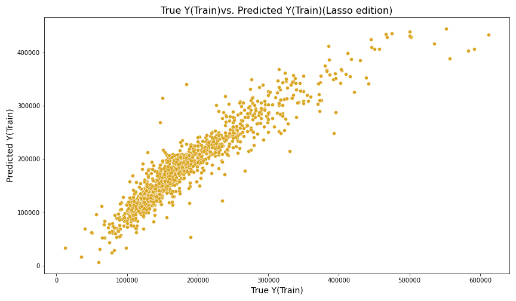

When applying the Lasso regularization there was a minuscule improvement on the training data from 88.244810 to 88.244815.  And a bit of an improvement with the testing data from 80.642 to 80.648 which slightly reduces the variance but still leads to an overfit model that does not generalize to new data as well as it does to the training data indicating that its still modeling too much noise in the data.
### Model 6
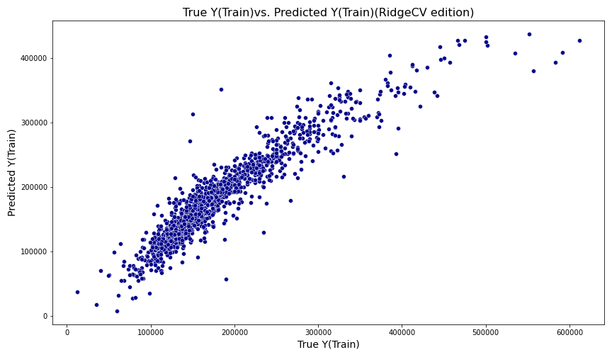

This model also deviates from model 4 and when applying the Ridge regression with an optimal alpha, we get a training R2 of 86.30% while the testing R2 is 82.54%.  When we compare it to the Lasso regression model we have a slight decline in improvement from 88.24% to 86.30%, but we have an improvement with the testing as it increases from 80.64% to 82.54%.  This model generalizes slightly better to newer data and has decreased its variance but is still modeling to some of the noise in the data.  While the model is still overfit we are trending in the right direction. If we are to improve the balance of the bias-variance we may have to couple regularization with decreasing complexity of the model.  If we go back to our original baseline model that scored 67.59% for testing data, this latest iteration of the model has increased by about 15 points in accuracy.

### Model 7

Decided to be more selective with the features, and dropped those with extremely low correlations. Once that happened then I applied the polynomial features to it. This has lead to a somewhat slightly underfit model that scores less on training data at 84.17% but scored the highest yet on the testing data with a score of 84.44%.  This model seems to have a bit more bias than any of my previous models, thus it is underfit, and therefore does not need regularization. Also, a model that has been subjected to Standard Scaler. This model does the best job in finding that optimal sweet spot where we are balancing the bias and variance in order to minimize error.
Reference:lesson Bias-Variance

## Conclusions & Recommendations.

The initial premise here was to predict a price for a home using a linear regression model that outperforms a baseline model.  After iterating through several models, I selected a Linear Regression model that whittled down features based on very poor correlation.  From there the polynomial features transformation and the standard scaler were applied.  This ended up having the best R2 Score for testing portion of the train-test-split.  It had an R2 score of 83.41% which was an improvement over the baseline of the original model many iterations ago, that baseline had a score of 65.59%.  Thats a shade under an 18 points of improvement in the R2 score.  In other words there was a 65.59% of the variance in our sales price  that could be explained by the features in our model to begin with, and that has improved to 83.41% of the variance/variability in our sales price that could be explained by the features in our model. Also worth noting that the testing RMSE of this model was 32307.37 which is a decrease from the first model RMSE of 43739.88. This can be good because you want RMSE as close to 0 as possible and is in the dollar units of salesprice so in a sense the predicted y is closer to actual y. This is something that could help benefit homeowners and the real estate agents that work with them as far as being able to know what an adequate price is that would enable them to sell the home.  As we know from the research portion of this being overpriced will not allow for you to sell the home and underpricing it really harms the homeowner. Future steps to move the project forward would involve even more research that could help feature engineer even more useful x variables that could contribute to the model. Regularization really helped decrease the variance between the training and testing R2 scores as well, and actually lead to improvements in the lowest RMSE as well.

| **Model** | **Train RMSE** | **Test RMSE** | **Train R2** | **Test R2** |
|-----------|----------------|---------------|--------------|-------------|
| Model_1   | 29587.55       | 43739.88      |      .85     |     .72     |
| Model_2   | 30098.74       | 42362.35      |      .85     |     .73     |
| Model_3   | 18850.60       | 109767.34     |      .94     |     -.79    |
| Model_4   | 27087.66       | 41485.18      |      .88     |     .74     |
| Model_5   | 27087.68       | 41483.23      |      .88     |     .74     |
| Model_6   | 27270.32       | 40967.73      |      .87     |     .74     |
| Model_7   | 31694.52       | 32307.37      |      .83     |     .83     |
## Next steps

Future steps to move the project forward would involve even more research that could help feature engineer even more useful x variables that could contribute to the model.
# housing_data_analysis
